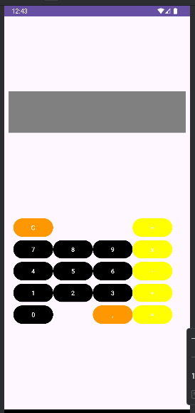

<h1 align="center">Calculadora</h1>

## Project
This project is a calculator app built with Android Studio, using Kotlin for the logic and XML for the layout design.  This project demonstrates core Android development practices, including UI components, resource management, and Kotlin programming basics for mobile applications.

## Layout
<div align="center">
  
</div>

## Technologies Used
- *Programming Language:* Kotlin
- *Development Environment:* Android Studio

## Code Author
```kotlin
fun main() {
    println("Code by Marcela Geremias!")
}